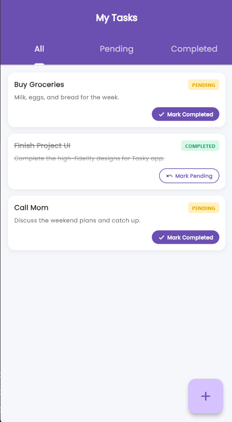
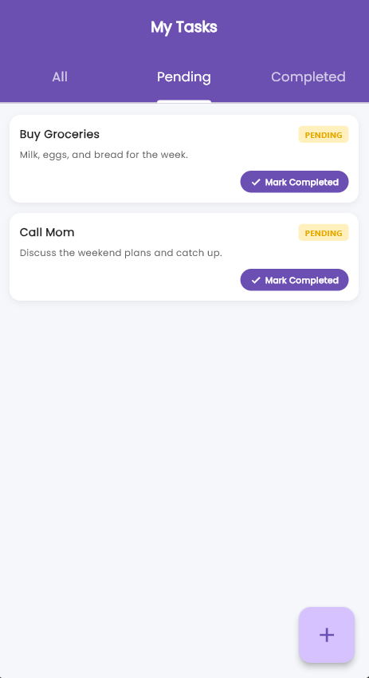
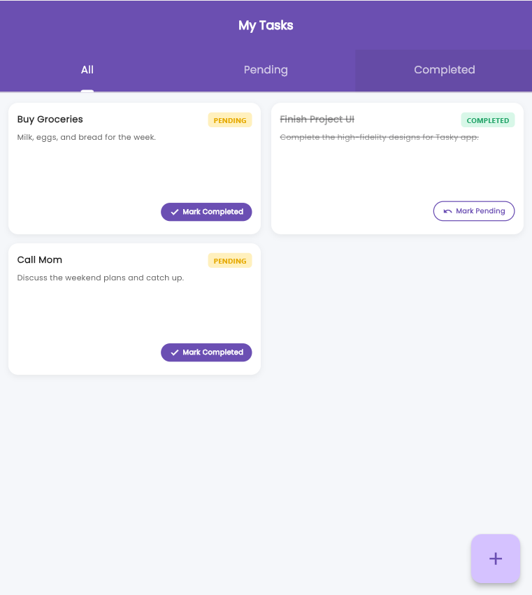
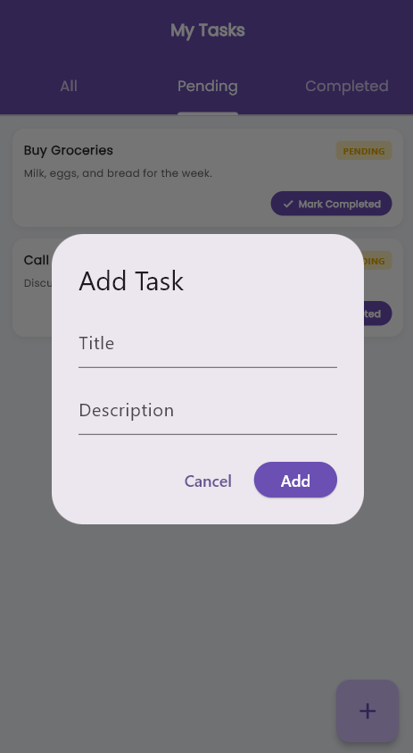

# fad_flutter_task
# Responsive Tasks Screen UI - Flutter

## Project Overview

This project is a responsive Flutter Tasks screen designed to provide a consistent user experience across different screen sizes.

The application includes separate layouts for **mobile** , **tablet** , **desktop**  devices while maintaining a clean and modern UI. Text sizes are also responsive using a custom **Scale Factor** calculation instead of relying on external packages.

---

# Features

- Responsive Tasks Screen with basic functionality (Add Task, Toggle Task Status).
- Filter Tasks by Status (All, Pending, Completed).
- Responsive Typography using Scale Factor calculation

---

# Responsive Design

The application adapts its layout based on the screen size.

### Mobile
- Optimized spacing
- Mobile-friendly form layout
- Properly scaled text and buttons

### Tablet
- Wider content layout
- Improved spacing
- Better utilization of larger screens

### Desktop
- Similar to Tablet layout

Text responsiveness is implemented using a custom **Scale Factor** calculation to ensure readable typography across all screen sizes. (this calculation is inside app styles file)

---

# Project Structure

```
lib
│
├── core
│   ├── app_colors
│   ├── app_strings
│   └── app_styles
│
├── data
│   ├── models
│   │   └── task_model.dart  
│   └── dummy_list.dart
│
├── views
│   └── home_view.dart
│   └── home_body.dart
│
└── widgets
    ├── add_task_button.dart
    ├── change_status_button.dart
    ├── status_badge.dart
    └── task_card.dart
    └── tasks_grid_view.dart  
    └── tasks_list_view.dart  
    └── adaptive_layout_widget.dart
    └── desktop_layout.dart
    └── mobile_layout.dart
    └── tablet_layout.dart

```

---

# How to Run

1. Clone the repository.

```bash
git clone <repository-link>
```

2. Install dependencies.

```bash
flutter pub get
```

3. Run the application.

```bash
flutter run
```

---

# Screenshots

| Mobile layout                        | Mobile second screen |
|--------------------------------|-----------------------|
|  |  |

| Tablet layout                          | Desktop Layout    |
|--------------------------------------   |-------------------|
|  |  |

Add Task
|-------------------------


---

# Technologies Used

- Flutter
- Dart

---

# Highlights

- Responsive UI without third-party responsive packages.
- Custom Scale Factor calculation for adaptive text sizing.
- Reusable widgets for better code organization.
- Clean folder structure for maintainability.